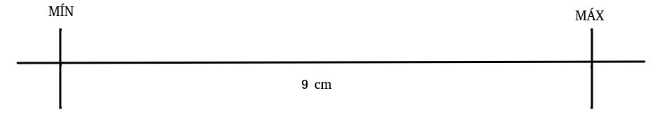
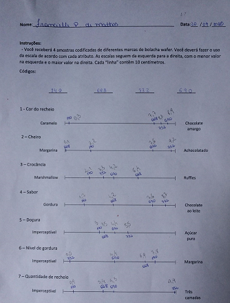

---
header-includes:
- \usepackage[brazil]{babel}
- \usepackage{float}
- \floatplacement{figure}{H}
- \usepackage{graphicx}
- \usepackage{multirow}
- \usepackage[alf]{abntex2cite}
output:
  html_document:
    code_folding: hide
    fig_caption: yes
    fig_height: 6
    fig_width: 7
    highlight: tango
    number_sections: yes
    theme: flatly
    toc: yes
    toc_depth: 2
    toc_float:
      collapsed: no
      smooth_scroll: no
  pdf_document:
    toc: yes
    toc_depth: '2'
---

\[\mathbf{\text{Universidade Federal do Paraná}}\]

\[\mathbf{\text{CE063C - Sensometria}}\]

\[\mathbf{\text{Análise Quantitativa Descritiva (ADQ)}}\]

\[\mathbf{\text{Avaliação de Marcas de Wafer Sabor Chocolate}}\]


```{r, echo=FALSE}
#setwd("~/Dropbox/sens/apresentação")
```


# ADQ

Métodos sensoriais descritivos são muito utilizados na indústria de alimentos quando se tem interesse em verificar a qualidade sensorial de um produto. 

Dentre as técnicas disponíveis está a chamada **Análise Descritiva Quantitativa (ADQ)**. Trata-se de um método que visa identificar e quantificar os atributos sensoriais de alimentos.

<blockquote>
  <p>
  A Análise Descritiva Quantitativa (ADQ) é a técnica de descrição
  sensorial mais utilizada na área de alimentos, pois permite o
  levantamento, a descrição e a quantificação dos atributos sensoriais
  detectáveis no produto, utilizando julgadores com alto grau de
  treinamento e análise estatística dos dados (STONE e SIDEL, 2004).
  </p>
</blockquote>

Pode-se citar como possíveis aplicações do ADQ:

 - Acompanhamento de produtos concorrentes
 - Testes de armazenamento para verificar possíveis alterações no decorrer do tempo 
 - Desenvolvimento de novos produtos
 - Controle da qualidade de alimentos
 - Determinações químicas versus respostas sensoriais

As etapas para realização da ADQ são: 

 1. Pré-seleção dos julgadores,
 2. Levantamento dos atributos, 
 3. Definições e referências dos atributos selecionados,
 4. Seleção final dos julgadores,
 5. Avaliação das amostras,
 6. Análise dos dados. 

---

# O Experimento

Para aplicação do método ADQ foram selecionadas 4 marcas de wafer de sabor chocolate. Os produtos eram das marcas:

1. Jasmine
2. Orquidea
3. Mabel
4. Bauducco

---

# Brainstorming

A equipe de julgadores para a Análise Descritiva Quantitativa do experimento foi composta pelos alunos da disciplina optativa CE063C - Sensometria na Universidade Federal do Paraná (UFPR).

Considerando as etapas citadas sessão **ADQ** para realização de uma Análise Descritiva Quantitativa, os passos 2 (levantamento dos atributos) e 3 (definições e referências dos atributos selecionados) foram chamados de 'brainstorming'.

Nesta etapa todos os 9 avaliadores provaram os produtos das diferentes marcas a fim de elencar atributos possíveis de serem avaliados por todo o grupo. Foram listadas características relacionadas à aparência, aroma e sabor.

Após todos os avaliadores provarem os produtos e elencarem, individualmente, características viáveis de avaliação, foi eleito um mediador para unificar as provas individuais em um único conjunto de atributos que realmente descrevessem os atributos das amostras.

Por fim, com os atributos selecionados, os avaliadores definiram as referências para construção da escala (uma referência de mínimo e uma de máximo). E, com a escala definida, foi realizado o treinamento dos avaliadores com as devidas escalas.

---

# Escala e Atributos

Com os atributos escolhidos e referências definidas, foram montadas as fichas de avaliação, com escalas não estruturadas de 9 centímetros, ancoradas nos pontos extremos definidos como referência: à esquerda pela referência que representava ausência ou mínimo do atributo e à direita pelo máximo ou presença do atributo.



Os atributos e referências selecionadas foram:

```{r, eval=F, echo=F}
\begin{table}[]
\begin{tabular}{lllll}
\hline
\multirow{2}{*}{} & \multirow{2}{*}{Atributo} & \multirow{2}{*}{Definição} & \multicolumn{2}{l}{Referência} \\ \cline{4-5} 
                  &                           &                            & Mínimo         & Máximo        \\ \cline{1-3}
1                 &                           &                            &                &               \\
2                 &                           &                            &                &               \\
3                 &                           &                            &                &               \\
4                 &                           &                            &                &               \\
5                 &                           &                            &                &               \\
6                 &                           &                            &                &               \\
7                 &                           &                            &                &               \\
8                 &                           &                            &                &               \\
9                 &                           &                            &                &               \\
10                &                           &                            &                &               \\
11                &                           &                            &                &               \\ \hline
\end{tabular}
\end{table}
```


|             | Atributo    | Definição   | Mínimo     | Máximo    |
|------------:|------------:|------------:|-----------:|:----------|
|            1| Cor recheio | Cor marrom escuro |  caramelo | Chocolate Amargo|
|            2| Cheiro      |  Cheiro parecido com chocolate | Margarina  | Achocolatado|
|            3| Crocância   | Nível de crocância|  Marshmallow          |  Ruffles         |
|            4| Sabor            |             |Gordura            |  Chocolate ao leite         |
|            5| Doçura            | Sensação provocada quando ingerimos açucar| Imperceptível | Açucar puro |
|            6| Nível de gordura   | Sensação pastosa deixada na boca | Imperceptível | Margarina  |
|            7|  Quantidade de recheio  | Presença de recheio aparente |  Imperceptível| Três camadas |

Os provadores selecionados participaram dos testes, onde as amostras foram servidas em bandejas padronizadas, com as amostras codificadas e balanceadas, juntamente com a ficha de avaliação com os atributos definidos na etapa de brainstorming e repetiu-se o procedimento 3 vezes por julgador.

---

# Dados 

Os dados foram coletados com os alunos da turma de Sensometria. Os alunos foram treinados e depois submetidos aos testes. Cada um executou o teste 3 vezes em 2 dias diferentes (Duas vezes 20/09 e a última 25/09). Depois de terminar os experimentos todos os resultados foram passados para o computador para começar as analises.

---

# Análise estatística

---

## Importação de dados

Os dados foram importados para o software da seguinte forma:

```{r, eval=FALSE}
dados <- read.csv2('data.csv', sep = ',', dec = '.', header = T)
```

---

## Análise Exploratória 

A fim de explorar os resultados graficamente, foram feitos gráficos com avaliadores x atributo e marca x atributo:

```{r, warning=FALSE}
# Exploratória

dados <- read.csv2('data.csv', sep = ',', dec = '.', header = T)


#-------------------------------------------------------------
library(ggplot2)
# julgador x atributo

ggplot(data = dados, mapping = aes(x=Pessoa, y=A1, color=Pessoa)) +
  geom_boxplot(alpha = 0.6)+
  stat_summary(fun.y=mean, 
               geom="point", 
               shape=20, 
               size=3, 
               color="red", 
               fill="red")+ 
  xlab('') + 
  ylab('') + 
  ggtitle('Atributo 1')

ggplot(data = dados, mapping = aes(x=Pessoa, y=A2, color=Pessoa)) +
  geom_boxplot(alpha = 0.6)+
  stat_summary(fun.y=mean, 
               geom="point", 
               shape=20, 
               size=3, 
               color="red", 
               fill="red")+ 
  xlab('') + 
  ylab('') + 
  ggtitle('Atributo 2')

ggplot(data = dados, mapping = aes(x=Pessoa, y=A3, color=Pessoa)) +
  geom_boxplot(alpha = 0.6)+
  stat_summary(fun.y=mean, 
               geom="point", 
               shape=20, 
               size=3, 
               color="red", 
               fill="red")+ 
  xlab('') + 
  ylab('') + 
  ggtitle('Atributo 3')

ggplot(data = dados, mapping = aes(x=Pessoa, y=A4, color=Pessoa)) +
  geom_boxplot(alpha = 0.6)+
  stat_summary(fun.y=mean, 
               geom="point", 
               shape=20, 
               size=3, 
               color="red", 
               fill="red")+ 
  xlab('') + 
  ylab('') + 
  ggtitle('Atributo 4')

ggplot(data = dados, mapping = aes(x=Pessoa, y=A5, color=Pessoa)) +
  geom_boxplot(alpha = 0.6)+
  stat_summary(fun.y=mean, 
               geom="point", 
               shape=20, 
               size=3, 
               color="red", 
               fill="red")+ 
  xlab('') + 
  ylab('') + 
  ggtitle('Atributo 5')

ggplot(data = dados, mapping = aes(x=Pessoa, y=A6, color=Pessoa)) +
  geom_boxplot(alpha = 0.6)+
  stat_summary(fun.y=mean, 
               geom="point", 
               shape=20, 
               size=3, 
               color="red", 
               fill="red")+ 
  xlab('') + 
  ylab('') + 
  ggtitle('Atributo 6')

ggplot(data = dados, mapping = aes(x=Pessoa, y=A7, color=Pessoa)) +
  geom_boxplot(alpha = 0.6)+
  stat_summary(fun.y=mean, 
               geom="point", 
               shape=20, 
               size=3, 
               color="red", 
               fill="red")+ 
  xlab('') + 
  ylab('') + 
  ggtitle('Atributo 7')
```

```{r, warning=FALSE, message=FALSE}
#-------------------------------------------------------------

# marca x atributo

g1<-
  ggplot(data = dados, mapping = aes(x=Marca, y=A1, color=Marca)) +
  geom_boxplot(alpha = 0.6)+
  stat_summary(fun.y=mean, 
               geom="point", 
               shape=20, 
               size=3, 
               color="red", 
               fill="red")+ 
  xlab('') + 
  ylab('') + 
  ggtitle('Atributo 1')

g2<-
  ggplot(data = dados, mapping = aes(x=Marca, y=A2, color=Marca)) +
  geom_boxplot(alpha = 0.6)+
  stat_summary(fun.y=mean, 
               geom="point", 
               shape=20, 
               size=3, 
               color="red", 
               fill="red")+ 
  xlab('') + 
  ylab('') + 
  ggtitle('Atributo 2')

g3<-
  ggplot(data = dados, mapping = aes(x=Marca, y=A3, color=Marca)) +
  geom_boxplot(alpha = 0.6)+
  stat_summary(fun.y=mean, 
               geom="point", 
               shape=20, 
               size=3, 
               color="red", 
               fill="red")+ 
  xlab('') + 
  ylab('') + 
  ggtitle('Atributo 3')

g4<-
  ggplot(data = dados, mapping = aes(x=Marca, y=A4, color=Marca)) +
  geom_boxplot(alpha = 0.6)+
  stat_summary(fun.y=mean, 
               geom="point", 
               shape=20, 
               size=3, 
               color="red", 
               fill="red")+ 
  xlab('') + 
  ylab('') + 
  ggtitle('Atributo 4')

g5<-
  ggplot(data = dados, mapping = aes(x=Marca, y=A5, color=Marca)) +
  geom_boxplot(alpha = 0.6)+
  stat_summary(fun.y=mean, 
               geom="point", 
               shape=20, 
               size=3, 
               color="red", 
               fill="red")+ 
  xlab('') + 
  ylab('') + 
  ggtitle('Atributo 5')

g6<-
  ggplot(data = dados, mapping = aes(x=Marca, y=A6, color=Marca)) +
  geom_boxplot(alpha = 0.6)+
  stat_summary(fun.y=mean, 
               geom="point", 
               shape=20, 
               size=3, 
               color="red", 
               fill="red")+ 
  xlab('') + 
  ylab('') + 
  ggtitle('Atributo 6')

g7<-
  ggplot(data = dados, mapping = aes(x=Marca, y=A7, color=Marca)) +
  geom_boxplot(alpha = 0.6)+
  stat_summary(fun.y=mean, 
               geom="point", 
               shape=20, 
               size=3, 
               color="red", 
               fill="red")+ 
  xlab('') + 
  ylab('') + 
  ggtitle('Atributo 7')

library(ggpubr)
ggarrange(g1,g2,g3,g4,
          g5,g6,g7,
          nrow = 3, ncol=3,
          common.legend = TRUE, 
          legend="bottom",
          #labels = 'TÍTULO',
          font.label = list(size = 18, 
                            face = "bold"))

```


---

## ANOVA

Código genérico para realização da Análise de Variância por atributo e Marca:

```{r, eval=FALSE}

aov(Atributo ~ Avaliador, data = dados) # avaliador

aov(Atributo ~ Marca, data = dados) # marca

```


---

### Por Atributo 

Deseja-se avaliar se existe um concenso entre os avaliadores de acordo com as marcas utilizadas.
Assumindo independencia entre os avaliadores:

```{r, echo = TRUE, results = TRUE}
#Lendo os dados

#data <- "/home/will/Documentos/Will Meira/GitHub/Disciplinas/Optativas/CE063C - Sensometria/Experimento 05 - ADQ/Apresentação/data.csv"

dados <- read.csv('data.csv', header = TRUE, sep = ",", dec = ",")
```


#### Atributo 1

```{r, echo = TRUE, results = TRUE}
## Atributo 1
dados$A1 <- as.numeric(as.character(dados$A1))
anova1<-aov(A1 ~ Marca,data = dados)
summary(anova1)

```

#### Atributo 2

```{r, echo = TRUE, results = TRUE}
## Atributo 2
dados$A2 <- as.numeric(as.character(dados$A2))
anova2<-aov(A2 ~ Marca,data = dados)
summary(anova2)
```

#### Atributo 3

```{r, echo = TRUE, results = TRUE}
## Atributo 3
dados$A3 <- as.numeric(as.character(dados$A3))
anova3<-aov(A3 ~ Marca,data = dados)
summary(anova3)
```

#### Atributo 4

```{r, echo = TRUE, results = TRUE}
## Atributo 4
dados$A4 <- as.numeric(as.character(dados$A4))
anova4<-aov(A4 ~ Marca,data = dados)
summary(anova4)
```

#### Atributo 5

```{r, echo = TRUE, results = TRUE}
## Atributo 5
dados$A5 <- as.numeric(as.character(dados$A5))
anova5<-aov(A5 ~ Marca,data = dados)
summary(anova5)
```

#### Atributo 6

```{r, echo = TRUE, results = TRUE}
## Atributo 6
dados$A6 <- as.numeric(as.character(dados$A6))
anova6<-aov(A6 ~ Marca,data = dados)
summary(anova6)
```

#### Atributo 7

```{r, echo = TRUE, results = TRUE}
## Atributo 7
dados$A7 <- as.numeric(as.character(dados$A7))
anova7<-aov(A7 ~ Marca,data = dados)
summary(anova7)
```

### Por Avaliador

Deseja-se avaliar se existe um concenso entre os avaliadores de acordo com as marcas utilizadas.
Assumindo independencia entre os avaliadores:

#### Atributo 1

```{r, echo = TRUE, results = TRUE}

anova1p <- aov(A1 ~ as.factor(Pessoa), data = dados)
summary(anova1p)
```

#### Atributo 2

```{r, echo = TRUE, results = TRUE}

dados$A2 <- as.numeric(as.character(dados$A2))
anova2p <- aov(A2 ~ as.factor(Pessoa), data = dados)
summary(anova2p)
```

#### Atributo 3

```{r, echo = TRUE, results = TRUE}

dados$A3 <- as.numeric(as.character(dados$A3))
anova3p <- aov(A3 ~ as.factor(Pessoa), data = dados)
summary(anova3p)
```

#### Atributo 4

```{r, echo = TRUE, results = TRUE}
dados$A4 <- as.numeric(as.character(dados$A4))
anova4p <- aov(A4 ~ as.factor(Pessoa), data = dados)
summary(anova4p)
```

#### Atributo 5

```{r, echo = TRUE, results = TRUE}
dados$A5 <- as.numeric(as.character(dados$A5))
anova5p <- aov(A4 ~ as.factor(Pessoa), data = dados)
summary(anova5p)
```

#### Atributo 6

```{r, echo = TRUE, results = TRUE}
dados$A6 <- as.numeric(as.character(dados$A6))
anova6p <- aov(A3 ~ as.factor(Pessoa), data = dados)
summary(anova6p)
```

#### Atributo 7

```{r, echo = TRUE, results = TRUE}
dados$A7 <- as.numeric(as.character(dados$A7))
anova7p <- aov(A7 ~ as.factor(Pessoa), data = dados)
summary(anova7p)
```

---

## Gráfico de interação

---

## Comparações Múltiplas

Teste de comparações multiplas:
Um dos métodos que podemos utilizar para avaliar a magnitude dessas diferenças é através do teste de Tukey.

### Atributo 1

```{r, echo = TRUE, result = TRUE}
TukeyHSD(anova1)
```

### Atributo 2

```{r, echo = TRUE, result = TRUE}
TukeyHSD(anova2)
```

### Atributo 3

```{r, echo = TRUE, result = TRUE}
TukeyHSD(anova3)
```

### Atributo 4

```{r, echo = TRUE, result = TRUE}
TukeyHSD(anova4)
```

### Atributo 5

```{r, echo = TRUE, result = TRUE}
TukeyHSD(anova5)
```

### Atributo 6

```{r, echo = TRUE, result = TRUE}
TukeyHSD(anova6)
```

### Atributo 7

```{r, echo = TRUE, result = TRUE}
TukeyHSD(anova7)
```

---

## Gráfico de radar 

Com atributos mais significativos

---

# Conclusões 

---

# Erros cometidos

1º Erro observado - Elaboração das fichas:

- Ausência de uma folga nas escalas

- Divergência de tamanho entre o tamanho da impressão nas folhas

- Divergencia entre o tamanho de cada "linha" informado nas instruçôes e o verdadeiro valor da "linha"

- Separação dos atributos entre aparência, aroma e etc.




2º erro observado - Aleatorização:

- Aleatorizalçao foi feita com a funcão "sample", ao invés de ser feita com a função "williams.design".


3º erro observado - 


---
